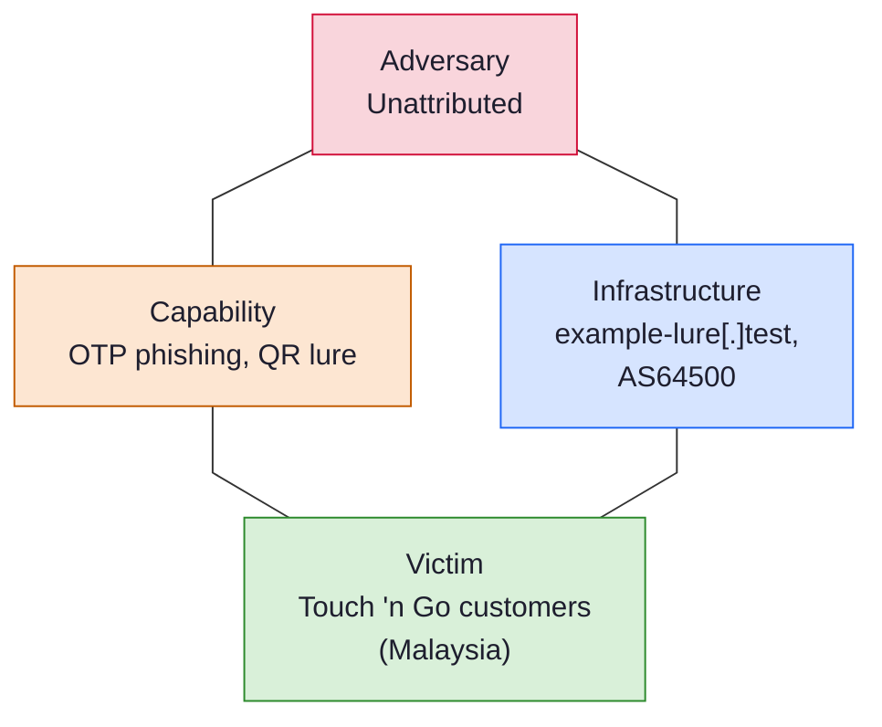

# Fukuro Triage Report

- **Indicator:** `hxxps://tng-verify[.]example-lure[.]test/login` (url)
- **Verdict:** MALICIOUS (score -2)
- **Generated:** 2026-09-21 18:07 UTC
- **Sharing:** TLP:CLEAR (published publicly)
- **Impersonates:** Touch 'n Go
- **Resolves to:** `203[.]0[.]113[.]7`

## Why this verdict

- Analyst confirmed this is a phishing page impersonating Touch 'n Go. This was a human decision, not detected automatically
- Synthetic test case: nothing here is real

The score is a transparent rule-based sum of the findings above, not an analyst judgment.

## QR code

- **Type:** Web link
- **Contents:** `hxxps://tng-verify[.]example-lure[.]test/login`

## Where the link goes

| Hop | URL | Result | Server IP |
| --- | --- | --- | --- |
| 1 | `hxxps://tng-verify[.]example-lure[.]test/login` | HTTP 200 | `203[.]0[.]113[.]7` |

Final destination: `hxxps://tng-verify[.]example-lure[.]test/login`

## Landing page

- **Title:** Verify your account
- **Title:** Verify your account
- **Password field:** No
- **Phone number field:** Yes
- **Asks for a phone number and a one-time code:** Yes

## Analyst notes

- TEST UPLOAD. This is a synthetic case (a reserved .test domain and documentation IP range) created only to verify that publishing works. It describes no real site, person or incident. Safe to delete.

## TTPs

Tactics, techniques and procedures, mapped to MITRE ATT&CK. Each row is backed by something that was observed.

| Tactic | Technique | ID | Procedure |
| --- | --- | --- | --- |
| Initial Access | Phishing: Spearphishing Link | T1566.002 | A phishing link delivered as a QR code |
| Resource Development | Acquire Infrastructure: Domains | T1583.001 | A domain registered 6 days ago |
| Reconnaissance | Phishing for Information: Spearphishing Link | T1598.003 | The page asks for a phone number and a one-time code |

## Intrusion analysis

Event: Phishing impersonating Touch 'n Go, from a QR code (example-lure[.]test, 2026-09-21).

Confidence is High when the finding was observed directly, and Medium or Low when it is an assessment. Unknown means it could not be determined.

| Feature | Aspect | Finding | Confidence |
| --- | --- | --- | --- |
| Adversary | Identity | Unattributed | Unknown |
| Adversary | Operator or customer | Unknown. Nothing shows whether the operator built the kit or bought it | Unknown |
| Adversary | Likely motivation | Financial: theft of account credentials | Medium (assessed) |
| Capability | Lure | Page that asks for a phone number and one-time code impersonating Touch 'n Go | High |
| Capability | Delivery | QR code (quishing) | High |
| Capability | ATT&CK techniques | T1566.002, T1583.001, T1598.003 | Medium (assessed) |
| Infrastructure | Lure domain | example-lure[.]test, registered 6 days ago | High |
| Infrastructure | Infrastructure type | Type 1 (likely): newly registered, so probably bought by the adversary | Medium (assessed) |
| Infrastructure | Hosting | 203[.]0[.]113[.]7 (AS64500 Example Hosting (documentation range), MY) | High |
| Victim | Persona | Customers of Touch 'n Go in Malaysia | High (analyst) |
| Victim | Target assets | Phone number and one-time codes (a phone and code request was observed) | High |
| Victim | How it reached them | A QR code. Where it was displayed is not recorded | High |
| Victim | Real individuals | None identified or recorded here | Unknown |

| Meta-feature | Value |
| --- | --- |
| Timestamp | Analysed 2026-09-21. The domain was registered about 2026-09-15 |
| Phase | Delivery: the link is presented to the victim as a QR code; Exploitation: the victim is asked for a phone number and one-time code (form observed); Actions on objectives: credential theft for fraud or account takeover (assessed) |
| Result | Unknown. This tool cannot see whether anyone was deceived |
| Direction | Adversary to victim |
| Methodology | Phishing: phone number and one-time code capture, delivered by QR code (quishing) |
| Resources | A recently registered domain, hosting at AS64500 Example Hosting (documentation range) |
| Social-political axis | A financially motivated actor targeting users of a Malaysian brand (assessed, low confidence) |
| Technology axis | A QR lure leading to a phone and code capture page hosted at AS64500 Example Hosting (documentation range) on a newly registered domain |

Where to pivot next:

- Find other domains on 203[.]0[.]113[.]7 (reverse IP: Censys, Shodan, VirusTotal relations)
- Look for other lookalikes of Touch 'n Go registered recently (certificate transparency: search crt.sh for the brand name)
- Check example-lure[.]test on urlscan.io and VirusTotal for sibling domains and related pages

What is not known:

- Who the adversary is
- Whether anyone was deceived, and how many
- Which phishing kit or toolset was used

## Indicators (defanged)

| Type | Value | Use |
| --- | --- | --- |
| url | `hxxps://tng-verify[.]example-lure[.]test/login` | Block |
| ipv4 | `203[.]0[.]113[.]7` | Context, review first |
| domain | `tng-verify[.]example-lure[.]test` | Block |

## Recommended actions

1. Keep the message and attachment quarantined. Do not release.
2. Search mail logs for other recipients of the same sender, subject or hash.
3. Block the indicators marked for blocking at the gateway, proxy and EDR.
4. If anyone opened it, isolate that host and reset their credentials.
5. Share the indicators to MISP or OpenCTI using the exports.
6. Report the page to Touch 'n Go's abuse or fraud team and to MyCERT (Cyber999) for takedown.
7. Submit the URL to Google Safe Browsing and VirusTotal so browsers and scanners start blocking it.
8. If the QR code was a physical sticker or poster, photograph it, remove it, and check nearby codes.
