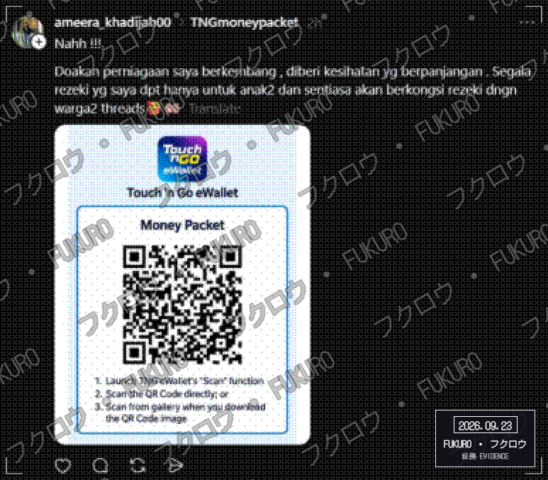
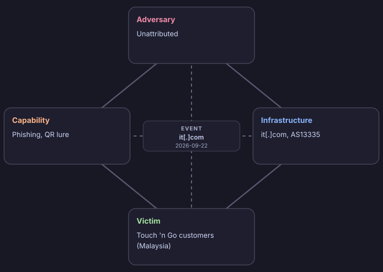

# Fukuro Triage Report

- **Indicator:** `hxxps://qxxdaft[.]it[.]com/moneypacketmp` (url)
- **Verdict:** MALICIOUS (score 3)
- **Generated:** 2026-09-22 23:41 UTC
- **Sharing:** TLP:CLEAR (published publicly)
- **Impersonates:** Touch 'n Go
- **Resolves to:** `172[.]67[.]191[.]98`

## Why this verdict

- Analyst confirmed this is a phishing page impersonating Touch 'n Go. This was a human decision, not detected automatically
- Tranco: a top 10,000 site (rank #877), ranked for 30 of the last 30 days
- RansomLook: it.com is named on a ransomware leak site (spirals, 2026-09-18). That means it was attacked, not that it is malicious
- AbuseIPDB: no abuse reports on record
- Could not load the page (Timed out). Phishing pages are often already taken down.

The score is a transparent rule-based sum of the findings above, not an analyst judgment.

## QR code

- **Type:** Web link
- **Contents:** `hxxps://qxxdaft[.]it[.]com/moneypacketmp`

## Where the link goes

| Hop | URL | Result | Server IP |
| --- | --- | --- | --- |
| 1 | `hxxps://qxxdaft[.]it[.]com/moneypacketmp` | Error: Timed out |  |

## Where it was posted

This link or QR code was posted by the accounts below. The accounts are not verified: an account that posts a lure can belong to the adversary, or be compromised or an impersonation, so this is a distribution channel and not attribution.

- Threads: `@ameera_khadijah00` (posted 2026-09-22)

## Evidence

## TTPs

Tactics, techniques and procedures, mapped to MITRE ATT&CK. Each row is backed by something that was observed.

| Tactic | Technique | ID | Procedure |
| --- | --- | --- | --- |
| Initial Access | Phishing: Spearphishing Link | T1566.002 | A phishing link delivered as a QR code |

## Intrusion analysis

Event: Phishing impersonating Touch 'n Go, from a QR code (it[.]com, 2026-09-22).

Confidence is High when the finding was observed directly, and Medium or Low when it is an assessment. Unknown means it could not be determined.

| Feature | Aspect | Finding | Confidence |
| --- | --- | --- | --- |
| Adversary | Identity | Unattributed | Unknown |
| Adversary | Operator or customer | Unknown. Nothing shows whether the operator built the kit or bought it | Unknown |
| Adversary | Likely motivation | Financial: theft of account credentials | Medium (assessed) |
| Capability | Lure | Phishing page impersonating Touch 'n Go | High (analyst) |
| Capability | Delivery | QR code (quishing) | High |
| Capability | ATT&CK techniques | T1566.002 | Medium (assessed) |
| Infrastructure | Lure domain | it[.]com | High |
| Infrastructure | Infrastructure type | Type 2 (likely): this organisation is a ransomware victim, so the site may be compromised | Low (assessed) |
| Infrastructure | Distribution channel | Threads @ameera_khadijah00 (2026-09-22) posted the lure | High (analyst) |
| Infrastructure | Account type | Not determined: the accounts may belong to the adversary, be compromised, or be impersonations | Unknown |
| Infrastructure | Hosting | 172[.]67[.]191[.]98 (AS13335 Cloudflare, Inc., US) | High |
| Victim | Persona | Customers of Touch 'n Go in Malaysia | High (analyst) |
| Victim | Target assets | Account credentials, assessed from the impersonated login. No form was observed | Low (assessed) |
| Victim | How it reached them | A QR code. Where it was displayed is not recorded | High |
| Victim | Real individuals | None identified or recorded here | Unknown |

| Meta-feature | Value |
| --- | --- |
| Timestamp | Analysed 2026-09-22. First seen posted on 2026-09-22 |
| Phase | Delivery: the link is presented to the victim as a QR code, posted on Threads; Actions on objectives: credential theft for fraud or account takeover (assessed) |
| Result | Unknown. The page could not be loaded, and this tool cannot see whether anyone was deceived |
| Direction | Adversary to victim |
| Methodology | Phishing, delivered by QR code (quishing) |
| Resources | A domain, hosting at AS13335 Cloudflare |
| Social-political axis | A financially motivated actor targeting users of a Malaysian brand (assessed, low confidence) |
| Technology axis | A QR lure leading to a phishing page hosted at AS13335 Cloudflare |

Where to pivot next:

- Look through the public posts of Threads @ameera_khadijah00 for the same link, QR image or wording, and for other accounts reposting it
- Find other domains on 172[.]67[.]191[.]98 (reverse IP: Censys, Shodan, VirusTotal relations)
- Look for other lookalikes of Touch 'n Go registered recently (certificate transparency: search crt.sh for the brand name)
- Check it[.]com on urlscan.io and VirusTotal for sibling domains and related pages

What is not known:

- Who the adversary is
- Whether anyone was deceived, and how many
- Whether the accounts that posted it belong to the adversary
- What the page does. It could not be loaded, so capability details are limited
- Which phishing kit or toolset was used

## Indicators (defanged)

| Type | Value | Use |
| --- | --- | --- |
| url | `hxxps://qxxdaft[.]it[.]com/moneypacketmp` | Block |
| ipv4 | `172[.]67[.]191[.]98` | Context, review first |
| domain | `qxxdaft[.]it[.]com` | Block |

## Recommended actions

1. Keep the message and attachment quarantined. Do not release.
2. Search mail logs for other recipients of the same sender, subject or hash.
3. Block the indicators marked for blocking at the gateway, proxy and EDR.
4. If anyone opened it, isolate that host and reset their credentials.
5. Share the indicators to MISP or OpenCTI using the exports.
6. Report the page to Touch 'n Go's abuse or fraud team and to MyCERT (Cyber999) for takedown.
7. Submit the URL to Google Safe Browsing and VirusTotal so browsers and scanners start blocking it.
8. If the QR code was a physical sticker or poster, photograph it, remove it, and check nearby codes.
