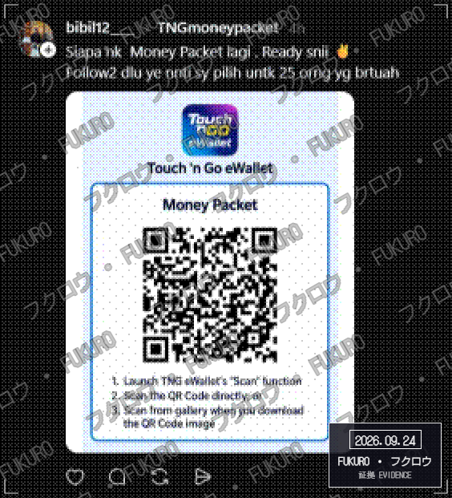
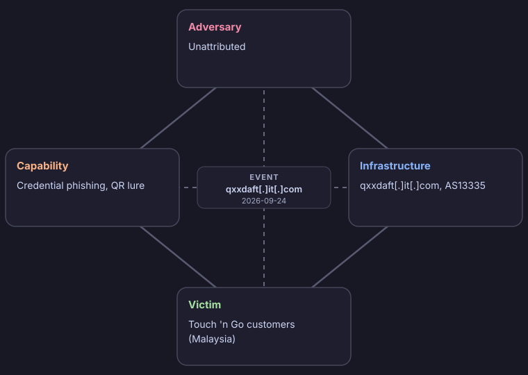

# Fukuro Triage Report

- **Indicator:** `hxxps://qxxdaft[.]it[.]com/moneypacketmp` (url)
- **Verdict:** MALICIOUS (score -2)
- **Generated:** 2026-09-24 12:57 UTC
- **Sharing:** TLP:CLEAR (published publicly)
- **Impersonates:** Touch 'n Go
- **Resolves to:** `172[.]67[.]191[.]98`

## Why this verdict

- Analyst confirmed this is a phishing page impersonating Touch 'n Go. This was a human decision, not detected automatically
- AbuseIPDB: no abuse reports on record
- Landing page has a password field
- Landing page asks for a phone number to send a Telegram login code

The score is a transparent rule-based sum of the findings above, not an analyst judgment.

## QR code

- **Type:** Web link
- **Contents:** `hxxps://qxxdaft[.]it[.]com/moneypacketmp`

## Where the link goes

| Hop | URL | Result | Server IP |
| --- | --- | --- | --- |
| 1 | `hxxps://qxxdaft[.]it[.]com/moneypacketmp` | HTTP 200 | `104[.]21[.]84[.]108` |

Final destination: `hxxps://qxxdaft[.]it[.]com/moneypacketmp`

## Landing page

- **Title:** A surprise Money Packet for you!
- **Title:** A surprise Money Packet for you!
- **Password field:** Yes
- **Phone number field:** Yes (the page mentions Telegram)
- **Asks for a phone number and a one-time code:** Yes

## Where it was posted

This link or QR code was posted by the accounts below. The accounts are not verified: an account that posts a lure can belong to the adversary, or be compromised or an impersonation, so this is a distribution channel and not attribution.

- Threads: `@bibil12____` (posted 2026-09-24)

## Evidence

## TTPs

Tactics, techniques and procedures, mapped to MITRE ATT&CK. Each row is backed by something that was observed.

| Tactic | Technique | ID | Procedure |
| --- | --- | --- | --- |
| Initial Access | Phishing: Spearphishing Link | T1566.002 | A phishing link delivered as a QR code |
| Reconnaissance | Phishing for Information: Spearphishing Link | T1598.003 | The page asks for a password and a Telegram phone number |

## Intrusion analysis

Event: Phishing impersonating Touch 'n Go, from a QR code (qxxdaft[.]it[.]com, 2026-09-24).

Confidence is High when the finding was observed directly, and Medium or Low when it is an assessment. Unknown means it could not be determined.

| Feature | Aspect | Finding | Confidence |
| --- | --- | --- | --- |
| Adversary | Identity | Unattributed | Unknown |
| Adversary | Operator or customer | Unknown. Nothing shows whether the operator built the kit or bought it | Unknown |
| Adversary | Likely motivation | Financial: theft of account credentials | Medium (assessed) |
| Capability | Lure | Credential-harvesting page impersonating Touch 'n Go | High |
| Capability | Delivery | QR code (quishing) | High |
| Capability | ATT&CK techniques | T1566.002, T1598.003 | Medium (assessed) |
| Infrastructure | Lure domain | qxxdaft[.]it[.]com | High |
| Infrastructure | Infrastructure type | Type 2: a shared platform the adversary uses, not one they own | High (assessed) |
| Infrastructure | Distribution channel | Threads @bibil12____ (2026-09-24) posted the lure | High (analyst) |
| Infrastructure | Account type | Not determined: the accounts may belong to the adversary, be compromised, or be impersonations | Unknown |
| Infrastructure | Hosting | 172[.]67[.]191[.]98 (AS13335 Cloudflare, Inc., US) | High |
| Victim | Persona | Customers of Touch 'n Go in Malaysia | High (analyst) |
| Victim | Target assets | Online account credentials (a login form was observed) | High |
| Victim | Target assets | Telegram account access: the page asks for a phone number, and a login code is the usual next step | Medium (assessed) |
| Victim | How it reached them | A QR code. Where it was displayed is not recorded | High |
| Victim | Real individuals | None identified or recorded here | Unknown |

| Meta-feature | Value |
| --- | --- |
| Timestamp | Analysed 2026-09-24. First seen posted on 2026-09-24 |
| Phase | Delivery: the link is presented to the victim as a QR code, posted on Threads; Exploitation: the victim is asked to type credentials into the fake page (login form observed); Exploitation: the victim is asked for a Telegram phone number (form observed); Actions on objectives: credential theft for fraud or account takeover (assessed) |
| Result | Unknown. This tool cannot see whether anyone was deceived |
| Direction | Adversary to victim |
| Methodology | Phishing: credential harvesting, delivered by QR code (quishing) |
| Resources | A domain, hosting at AS13335 Cloudflare |
| Social-political axis | A financially motivated actor targeting users of a Malaysian brand (assessed, low confidence) |
| Technology axis | A QR lure leading to a credential page hosted at AS13335 Cloudflare |

Where to pivot next:

- Look through the public posts of Threads @bibil12____ for the same link, QR image or wording, and for other accounts reposting it
- Find other domains on 172[.]67[.]191[.]98 (reverse IP: Censys, Shodan, VirusTotal relations)
- Look for other lookalikes of Touch 'n Go registered recently (certificate transparency: search crt.sh for the brand name)

What is not known:

- Who the adversary is
- Whether anyone was deceived, and how many
- Whether the accounts that posted it belong to the adversary
- Which phishing kit or toolset was used

## Indicators (defanged)

| Type | Value | Use |
| --- | --- | --- |
| url | `hxxps://qxxdaft[.]it[.]com/moneypacketmp` | Block |
| ipv4 | `172[.]67[.]191[.]98` | Context, review first |
| domain | `qxxdaft[.]it[.]com` | Block |
| ipv4 | `104[.]21[.]84[.]108` | Context, review first |

## Recommended actions

1. Keep the message and attachment quarantined. Do not release.
2. Search mail logs for other recipients of the same sender, subject or hash.
3. Block the indicators marked for blocking at the gateway, proxy and EDR.
4. If anyone opened it, isolate that host and reset their credentials.
5. Share the indicators to MISP or OpenCTI using the exports.
6. Report the page to Touch 'n Go's abuse or fraud team and to MyCERT (Cyber999) for takedown.
7. Submit the URL to Google Safe Browsing and VirusTotal so browsers and scanners start blocking it.
8. If the QR code was a physical sticker or poster, photograph it, remove it, and check nearby codes.
