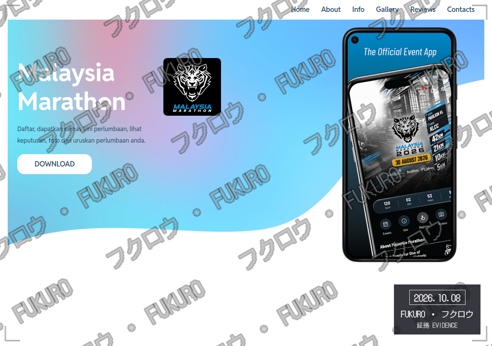
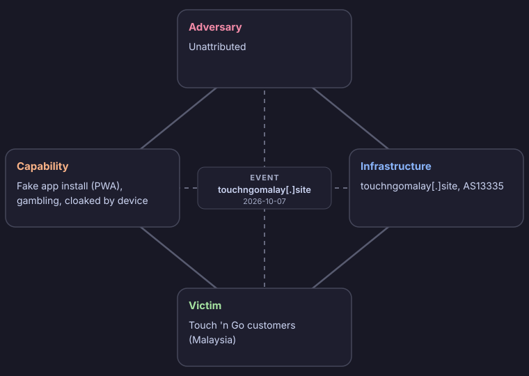

# Fukuro Triage Report

- **Indicator:** `touchngomalay[.]site` (domain)
- **Verdict:** MALICIOUS (score -10)
- **Generated:** 2026-10-07 23:06 UTC
- **Sharing:** TLP:CLEAR (published publicly)
- **Impersonates:** Touch 'n Go
- **Resolves to:** `172[.]67[.]128[.]26`

## Why this verdict

- VirusTotal: clean across 52 engines
- LeakIX: 600 exposed service(s) and 107 leak(s) indexed on this IP. Context, not a verdict on this indicator
- AbuseIPDB: no abuse reports on record
- RDAP: domain registered only 5 day(s) ago
- .site is a TLD commonly used for throwaway phishing domains
- Impersonation: touchngomalay[.]site contains "touchngo" but is not an official Touch 'n Go domain (touchngo.com.my).
- Shows phones a different page from desktops (phone: "App Market", desktop: "Malaysia Marathon")
- Desktop page "Malaysia Marathon" looks like a decoy: its download button links to Google Play: com.heyjom.malaysiamarathon, and its form sends nothing
- Phone page installs a web app (PWA) named "Touch'n Go Casino"
- Fake app store listing for "Touch'n Go Casino" by "Touch'n Go": claims 4.9 stars, 549,322 downloads, 15 reviews
- The web app signs the phone up for push notifications (sent to /subscribe)
- The web app's service worker names other domains: ihavefriendseverywhere[.]xyz

The score is a transparent rule-based sum of the findings above, not an analyst judgment.

## Where the link goes

| Hop | URL | Result | Server IP |
| --- | --- | --- | --- |
| 1 | `hxxps://touchngomalay[.]site/` | HTTP 200 | `104[.]21[.]1[.]221` |

Final destination: `hxxps://touchngomalay[.]site/`

## Landing page

- **Title:** Malaysia Marathon
- **Title:** Malaysia Marathon
- **Password field:** No

## Page after continue

The landing page collects nothing itself and shows no continue link in its HTML. If a button reveals the next page with script, paste that page's link into Hunting as well.

## Evidence

## Seen elsewhere

- **VirusTotal** already has a record of it (seen or scanned before). No engine flagged it as malicious at the time of this check.

## TTPs

Tactics, techniques and procedures, mapped to MITRE ATT&CK. Each row is backed by something that was observed.

| Tactic | Technique | ID | Procedure |
| --- | --- | --- | --- |
| Initial Access | Phishing: Spearphishing Link | T1566.002 | A phishing link |
| Resource Development | Acquire Infrastructure: Domains | T1583.001 | A domain that imitates Touch 'n Go |

## Intrusion analysis

Event: Fake gambling app lure impersonating Touch 'n Go (touchngomalay[.]site, 2026-10-07).

Confidence is High when the finding was observed directly, and Medium or Low when it is an assessment. Unknown means it could not be determined.

| Feature | Aspect | Finding | Confidence |
| --- | --- | --- | --- |
| Adversary | Identity | Unattributed | Unknown |
| Adversary | Operator or customer | Unknown. Nothing shows whether the operator built the kit or bought it | Unknown |
| Adversary | Likely motivation | Financial: deposits into an online gambling offer pushed through a fake app | Medium (assessed) |
| Capability | Evasion | Cloaking by device: phones get "App Market", desktops get "Malaysia Marathon" | High |
| Capability | Decoy page | Desktop visitors see a page impersonating "Malaysia Marathon", whose download button links to the real app (Google Play: com.heyjom.malaysiamarathon), with a form that sends nothing. It collects nothing, so it most likely exists to make the site look harmless to reviewers | Medium (assessed) |
| Capability | Lure | Fake app store listing for "Touch'n Go Casino" by "Touch'n Go" claiming 4.9 stars, 549,322 downloads, 15 user reviews | High |
| Capability | Delivery | Installs a web app (PWA) "Touch'n Go Casino" that opens full screen like a native app, start URL /pwa_d9cda55e-3163-45c9-9b57-be44f10117a5?v=d9cda55e-3163-45c9-9b57-be44f10117a5. No app file (APK) is downloaded | High |
| Capability | Persistence | Signs the phone up for push notifications after install, so it can keep sending messages | High |
| Capability | Service worker | hxxps://touchngomalay[.]site/PwaWorker[.]js, 8297 bytes, SHA-256 05d5c73094f7e495c3bbd5c4d6e4c6031078ede5a0ba243f3761f616ceb9685d | High |
| Capability | ATT&CK techniques | T1566.002, T1583.001 | Medium (assessed) |
| Infrastructure | Lure domain | touchngomalay[.]site, registered 5 days ago | High |
| Infrastructure | Infrastructure type | Type 1 (likely): newly registered, so probably bought by the adversary | Medium (assessed) |
| Infrastructure | Hosting | 172[.]67[.]128[.]26 (AS13335 Cloudflare, Inc., US) | High |
| Infrastructure | Web app backend | ihavefriendseverywhere[.]xyz, named in the service worker code. Not confirmed to be in use | Medium |
| Victim | Persona | Customers of Touch 'n Go in Malaysia | High |
| Victim | Target assets | Money: deposits into an online gambling offer, assessed from the app listing. No credential form was observed | Medium (assessed) |
| Victim | Device targeted | Phone users: desktops are shown a different page | High |
| Victim | Also impersonated | Malaysia Marathon, on the desktop decoy page. Its name is borrowed to look legitimate. Whether its own users are targeted too is not known | Medium (assessed) |
| Victim | Real individuals | None identified or recorded here | Unknown |

| Meta-feature | Value |
| --- | --- |
| Timestamp | Analysed 2026-10-07. The domain was registered about 2026-10-02 |
| Phase | Delivery: the link is presented to the victim; Installation: the phone page asks the victim to install a web app (observed); Command and control: the installed app subscribes the phone to push notifications (observed); Actions on objectives: steering the victim into gambling deposits (assessed) |
| Result | Unknown. This tool cannot see whether anyone was deceived |
| Direction | Adversary to victim |
| Methodology | Fake app install lure (PWA), using a lookalike domain, cloaked by device |
| Resources | A recently registered domain, hosting at AS13335 Cloudflare |
| Social-political axis | A financially motivated actor targeting users of a Malaysian brand (assessed, low confidence) |
| Technology axis | A cloaked link lure leading to a fake app install (PWA) hosted at AS13335 Cloudflare on a newly registered domain |

Where to pivot next:

- Find other domains on 172[.]67[.]128[.]26 (reverse IP: Censys, Shodan, VirusTotal relations)
- Look for other lookalikes of Touch 'n Go registered recently (certificate transparency: search crt.sh for the brand name)
- Search urlscan.io for other sites serving the same service worker (hash:05d5c73094f7e495c3bbd5c4d6e4c6031078ede5a0ba243f3761f616ceb9685d)
- Check ihavefriendseverywhere[.]xyz on urlscan.io and VirusTotal for other web apps using the same backend
- Revisit as a phone and as a desktop later: cloaked pages change content
- Check touchngomalay[.]site on urlscan.io and VirusTotal for sibling domains and related pages

What is not known:

- Who the adversary is
- Whether anyone was deceived, and how many
- The page after "continue", if there is one. The tool saw no next link in the HTML, so paste that link too
- Where the installed app finally sends the user: that link is set by script at run time and was not captured
- Which app kit or operator was used

## Indicators (defanged)

| Type | Value | Use |
| --- | --- | --- |
| domain | `touchngomalay[.]site` | Block |
| ipv4 | `172[.]67[.]128[.]26` | Context, review first |
| url | `hxxps://touchngomalay[.]site/` | Block |
| ipv4 | `104[.]21[.]1[.]221` | Context, review first |

## Recommended actions

1. Keep the message and attachment quarantined. Do not release.
2. Search mail logs for other recipients of the same sender, subject or hash.
3. Block the indicators marked for blocking at the gateway, proxy and EDR.
4. If anyone opened it, isolate that host and reset their credentials.
5. Share the indicators to MISP or OpenCTI using the exports.
6. Report the page to Touch 'n Go's abuse or fraud team and to MyCERT (Cyber999) for takedown.
7. Submit the URL to Google Safe Browsing and VirusTotal so browsers and scanners start blocking it.
